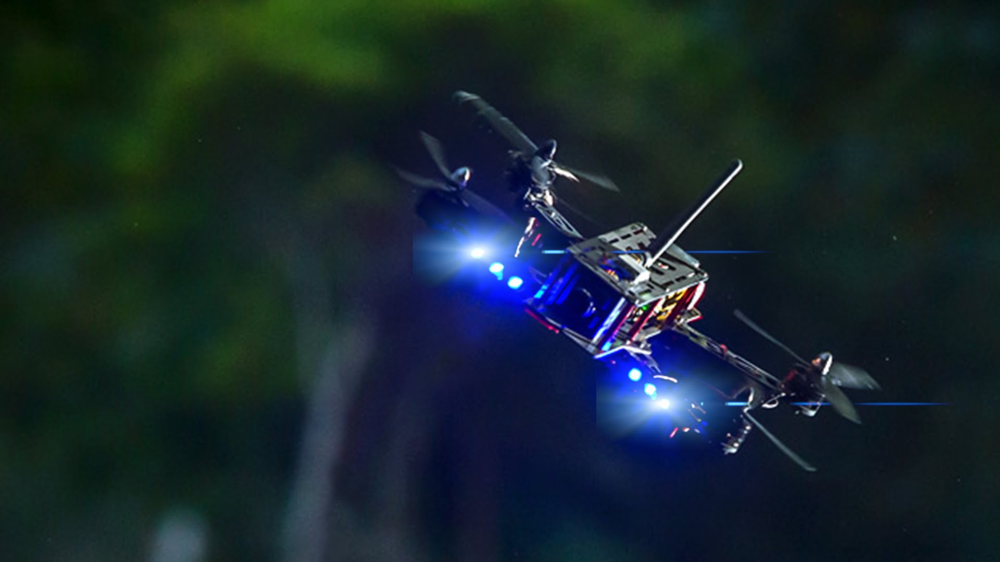
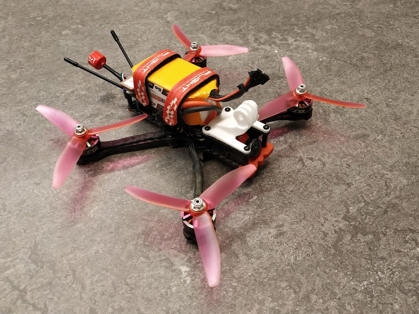

One day last summer while I was having an internship at Roborace, a colleague of mine turned up to work with a very dodgy looking contraption strapped to his backpack. It had bare circuit boards, exposed wires and looked like an electronics project I would have had in high school.

I got curious, took a 2nd look and oh it looked like a drone. As any excited roboticists, I went to ask him what that is. "Is this a disassembled DJI drone?", he just laughed. Then he told me it was actually a racing drone and that he built it himself.  I immediately asked him to show me how it flies here, in the office. He laughed again and explained that his drone could cover the length of the office in less than a second. At that point, I probably looked like a 9-year-old who just discovered video games.

Fast forward to the weekend, we went to a park in London to fly his drones (yes he had 4). When he took it to the sky, I was just mesmerised... He was flying at over 100 kph, doing rolls, power loops and dives from the sky. I didn't even need to touch the controller to know that this was the perfect hobby for me. It combines my robotics interests, electronics, open-source software development, the great outdoors and above all, is fun as hell!

Since then, I got obsessed with the world of first-person view quadcopters or just FPV quads for short. Quickly I found out that it was an expensive and time-consuming hobby with an awesome community behind it. For the remainder of this blog, I want to share my experiences getting into FPV interleaved with tips for other beginners. 

# First steps

The first thing I needed to do is to learn how to fly - it's difficult but also very rewarding. Learning to fly takes time, courage and above all perseverance. As per my friends’ advice, it's best to learn to fly in a simulation. When you crash in simulation, you press the reset button and start again. When you crash in the real world, you break stuff and spend time and money to repair it... and I sure did crash a lot as a beginner. As an example, out of my first 10 flights, I managed to land only twice without breaking anything. 

Cool, so what's next? You need a simulator and a controller (transmitter). I got the cheapest transmitter - the [FlySky FS-I6](https://www.banggood.com/FlySky-i6-FS-i6-2_4G-6CH-AFHDS-RC-Transmitter-Without-Receiver-p-1148659.html?rmmds=search&ID=42481529914&cur_warehouse=CN) with a [data cable](https://www.banggood.com/FlySky-Data-Cable-USB-Download-Line-For-FS-i6-FS-T6-Transmitter-Firmware-Update-p-982289.html?rmmds=search&cur_warehouse=CN). Regarding the simulator, there are many, I used [Liftoff](https://store.steampowered.com/app/410340/Liftoff_FPV_Drone_Racing/) as it had good reviews and a tutorial. However, it also requires a gaming computer. I spent about 5 hours on the tutorials (literally learning to stay in the air) and another 20 hours just flying until I was confident to get out into the real world. 

If you want to learn about other simulators have a [look here](https://www.getfpv.com/learn/fpv-essentials/fpv-drone-simulators/).

# Learning about the hobby 

In parallel to learning how to fly, I also learned about the hobby. I watched a lot of YouTube videos, read blog pages, forums and absorbed as much as I could. There's not much point in me reiterating what is already on the Internet so I'll just point you to the resources I used:

* [Joshua Bardwell’s YouTube](https://www.youtube.com/channel/UCX3eufnI7A2I7IkKHZn8KSQ) - literally the god of fpv building. Also has full build guides
* [getfpv](https://www.getfpv.com/learn/) - awesome website with the basics of fpv in written form
* [RotorBuilds](https://rotorbuilds.com/) - example builds by other hobbyists

# My first quad

I decided to build a quad myself as it looked fun and interesting. Furthermore, if you're getting into fpv, you'll be breaking your quad A LOT, so knowing how to repair it is essential.

 Quads generally have 2 main parameters:

* Propeller size - dictate the overall size of the quad
* Battery size - measured by the cell count. Range from 1S to 6S (cells) 

Quads can be split into categories based on their application:

* Whoop - tiny quad usually flown indoors with 1" props. Usually used for chill and fun racing.
* Toothpick - agile medium-sized quad usually with 2-3" props. Usually used for racing and is under 250g. 
* Cinewhoop - underpowered medium-sized quad with 3" props and ducts. Usually flown indoors for cinematic videos. 
* Full-size - large quad with 5-6" props. Flown outdoors for a variety of purposes. You can use these for racing, freestyle, cinematic and long-range flying.

I didn't know what I wanted to do with my quad, so I wanted to have a versatile one until I figured out what I like. So I decided to build a full-sized 5" 6S quad. This configuration supposedly gives you the best power to weight ratio as well as great versatility. However, I am still a student, so I wanted to build this on a budget. 

With the help of my friend, I made a cheap build based on the Eachine X220HV frame. Here is the full part list along with links and prices.

<table>
  <tr>
    <td>Frame</td>
    <td>Eachine Wizard X220HV</td>
    <td>£23.32</td>
  </tr>
  <tr>
    <td>Flight controller</td>
    <td>MAMBA F405 MK2</td>
    <td>£28.58</td>
  </tr>
  <tr>
    <td>Motors</td>
    <td>4x Emax ECO 2306 1700KV</td>
    <td>£34.48</td>
  </tr>
  <tr>
    <td>Propellers</td>
    <td>20x GepRC 5040 5 inch</td>
    <td>£15.33</td>
  </tr>
  <tr>
    <td>FPV Camera</td>
    <td>Foxeer Falkor 1200TVL</td>
    <td>£28.51</td>
  </tr>
  <tr>
    <td>FPV Transmitter</td>
    <td>Eachine TX806 (discontinued)</td>
    <td>£11.10</td>
  </tr>
  <tr>
    <td>FPV Antenna</td>
    <td>Foxeer 5.8G Omni</td>
    <td>£3.79</td>
  </tr>
  <tr>
    <td>Receiver</td>
    <td>Flysky X8B</td>
    <td>£10.81</td>
  </tr>
  <tr>
    <td>Batteries</td>
    <td>2x CHNL MiniStar 1250mAh 6S</td>
    <td>£46.75</td>
  </tr>
  <tr>
    <td>*Antenna holder</td>
    <td>3D printed</td>
    <td>£1.70</td>
  </tr>
  <tr>
    <td>*Antenna housing</td>
    <td>Geprc antenna tubes</td>
    <td>£2.86</td>
  </tr>
  <tr>
    <td>*Alarm buzzer</td>
    <td>Eachine</td>
    <td>£5.82</td>
  </tr>
  <tr>
    <td>*GPS</td>
    <td>Beitian BN-180</td>
    <td>£9.20</td>
  </tr>
  <tr>
    <td>Total</td>
    <td></td>
    <td>£222.25</td>
  </tr>
</table>

\* you don’t need this but they are nice to have

Additional equipment I needed to fly:

<table>
  <tr>
    <td>Transmitter</td>
    <td>FlySky FS-i6</td>
    <td>£32.49</td>
  </tr>
  <tr>
    <td>Simulator cable</td>
    <td>FS-i6 data cable</td>
    <td>£3.73</td>
  </tr>
  <tr>
    <td>Tool</td>
    <td>Prop wrench</td>
    <td>£2.45</td>
  </tr>
  <tr>
    <td>FPV goggles</td>
    <td>Eachine EV800D</td>
    <td>£70.68</td>
  </tr>
  <tr>
    <td>LiPo battery bag</td>
    <td>URUAV battery bag</td>
    <td>£2.93</td>
  </tr>
  <tr>
    <td>Battery charger</td>
    <td>iMAX B8</td>
    <td>£17.62</td>
  </tr>
  <tr>
    <td>Total</td>
    <td></td>
    <td>£129.9</td>
  </tr>
</table>

Note that this equipment can be used with other fpv quads you will make in the future

Without further ado, here is my first quad Diana, the goddess of hunting:

Building her was a long process involving mostly electrical work of soldering components together, wiring the different circuits that build Diana and assembling her altogether. For normal flying, I use the popular open-source software [Betaflight](https://betaflight.com/) and occasionally I use [iNav](https://github.com/iNavFlight/inav/wiki) when I want to do more autonomous flights. You can find a similar to Diana [build guide with the step by step process on RotorBuilds](https://rotorbuilds.com/build/16210). Note that I also designed and 3D printed some parts which you can see in the pictures above.

After 14 flight sessions, dozens and dozens of crashes, including hitting myself once, I have finally tamed Diana and can do some simple tricks!



# Missteps 

or things I would do differently if I had the chance 

* First and foremost, I wouldn't build a 5" quad for a beginner. I'd actually suggest getting a whoop like the Mobula6. It allows you to experience the hobby on a budget, fly regardless of the weather and avoid repairs from constant crashes because whoops are so light that it's difficult to break them. 
* If I had the money and confidence I would stick with the hobby, then I'd get a better transmitter and fpv goggles. 
* If you live in a rainy place, waterproof everything with conformal silicone coating! 
* Initially, I would limit the max throttle of the transmitter to 60-70% on a 4/6S quad. They have way too much power for any beginner. 

# What is next for me

As expected, I want to get better at flying, mostly freestyle and a bit of long-range. I simply enjoy flying out in the open and I want to do it whenever I have free time. However, since I am also a roboticist, I also have other more ambitious plans:

1. I want to contribute to the development of iNav and open-source autonomous drones. I think an open-source project like this with relatively cheap hardware has a lot of potential
2. I want to put an Nvidia Jetson TX2 on Diana (or another drone) and see what things I can push on it. Maybe some end-to-end deep learning? Maybe put my thesis on path planning and motion control on it?

